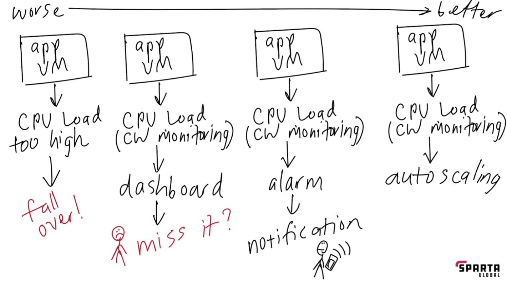

# Monolith vs 2-tier architecture

# What is it

##### Monolith:
* An application that runs on one machine and one database
##### 2-tier
* An Application running through seperate machines
  * better scalability 

# What are the differences?

##### Monolith:

#### 2-tier:
