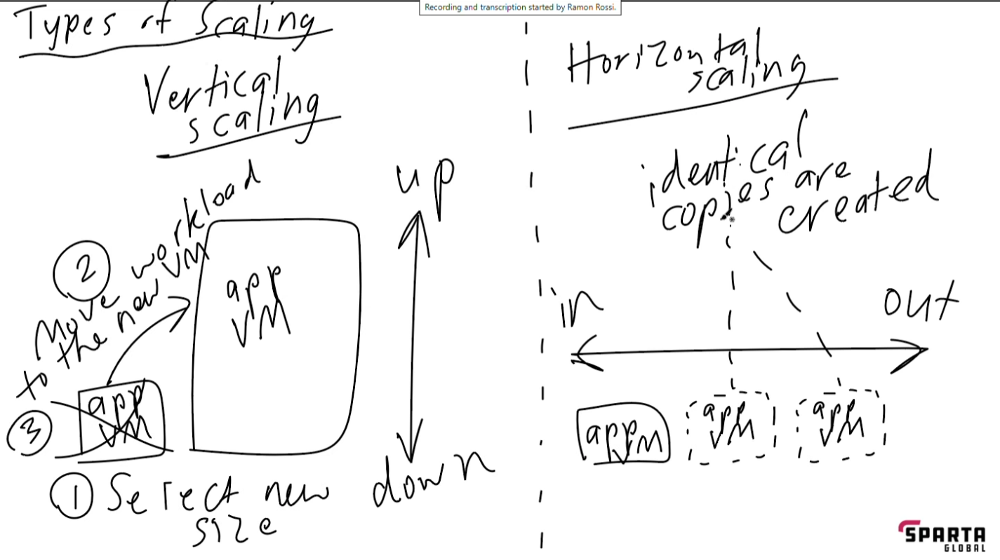
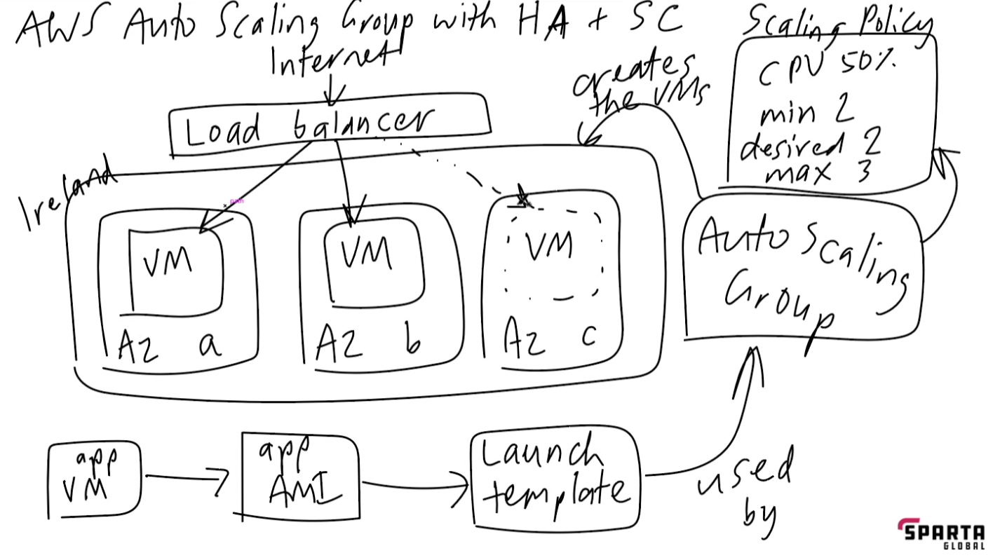

# monitoring, alarm management and auto scaling

## whats is it?

* used to test a sites/apps performance and how well it can withstand higher usage or loading of tasks.
* 

----------------------------------------------------------- 
# Apache Bench
## load testing with Apache Bench

> sudo apt-get install apache2-utils

* this creates a test of 100 users accessing your site and will then provide data metrics to show how long it took for all 100 test-load-ups to run

```
ab -n 1000 -c 100 http://yourwebsite.com/
```

* example with my site ip from app 
ab -n 1000 -c 100 http://108.129.94.31/
-----------------------------------------------------
# Scaling 

> diagram - vertical vs horizontal



> diagram - - vertical vs horizontal

### Types of scaling 

* Vertical Scaling 
  * upgrading current virtual machines to handle needs
<br>
* Horizontal Scaling
  * Produces identical copy virtual machines to deal with increased needs while keeping the size of the virtual machine
  
------------------------------------------------------

* Other cloud provider name alternatives- 

  * Azure virtual machine scale set
  * Instance Group or mig(managed instance group)
  
  ----------------------------------------------------- 

> diagram autoscaling

> diagram autoscaling
> 
App VM -> App AMI -> Launch Template -> AutoScaling Group -> creates VM [load balancer manages the VM's use]

Training course shortcut - 
HA - high availability
SC - Scalability 
AZ - Availability zone


>Load balancer - makes sure each vm being used in the auto scaling is % to work together to make the final outcome if you have 3 vm and they all put in 33.3% 

Auto scaling group =
  * decides availability zone 
  * creates VM's
  
  <br>


* target group - allows the load balancer to know which machines are not being used efficiently. 

--------------------------------------------------
